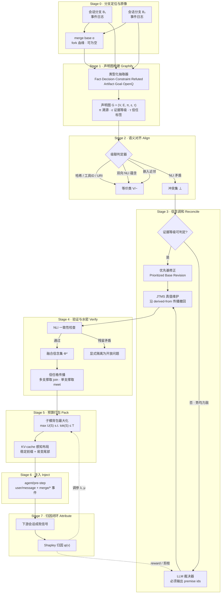
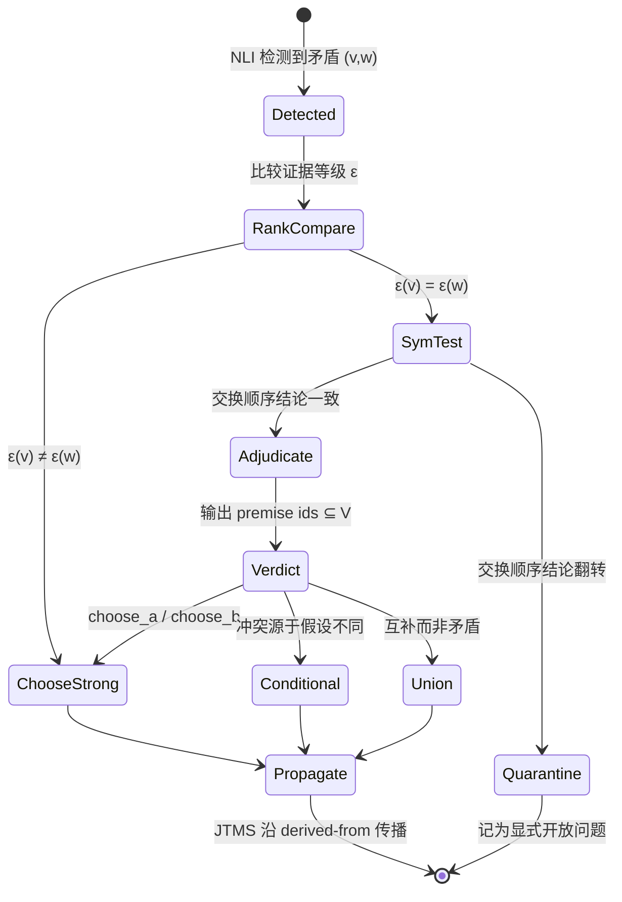

# 跨会话信念融合引擎 BeliefMerge
## 可行性分析 · 学习地图 · 算法逻辑架构

> 针对你在 DeepSeek 分享对话 `foioy0ul5efj0aac5i` 中提出的想法：
> **"把两个 AI 回答/会话的上下文（记忆、知识、推理过程）深度合并，注入到后续提问中"**

---

> ### ⚠️ 阅读前请注意：本文是**实现前的设计提案**，不是当前状态
>
> 本文写于立项时，项目此后已完成并发布。**当前实际边界**见
> [`belief-merge/TECHNICAL-REPORT.md`](../belief-merge/TECHNICAL-REPORT.md)
> 与 [`belief-merge/README.md`](../belief-merge/README.md) 的 Status 一节。
> 原文未作改动，但有两处会误导：
>
> **1. 第 6 节的 M0–M8 是"计划"，与插件 README 的 M0–M8 编号含义不同。**
>
> | | 本文（计划） | 实际实现 |
> |---|---|---|
> | M1 | 启发式去重（冗余声明 ↓40%） | **联合 LLM 对齐**抽取 |
> | M2 | NLI 冲突检测 | **受约束裁决器** + 运行时对称性检验 |
> | M3–M6 | 子模打包 / JTMS / 信任格 / MergeBench | 同左，已实现 |
> | M7 | **Shapley 归因闭环** | ❌ 未实现——插件的 M7 是 `merge_sessions` 工具与 `/merge` 命令 |
> | M8 | **学习式合并策略（DPO/RL）** | ❌ 未实现——插件的 M8 是设置面板 |
>
> **2. 第 0 节把 Shapley 归因列为"五个硬核点"之一，代码里没有它。**
> 实际落地的是四个：AGM/IC0–IC8 公理化算子、JTMS 标签传播、
> 信任格污点不变量、子模背包打包。全文另有数处把 Shapley 当作既有能力提及，
> 均属计划而非成果。
>
> 第 7 节"立刻可以做的下一步"是立项待办：前四项（环境验证、读源码、
> 端到端 spike、MergeBench）已完成；**与 `dsh-session-fork` 的定位关系至今未明确表态**。

---

# 0. 先说结论

| 问题 | 结论 |
|---|---|
| 你的链接我能读到吗 | 能。分享页是 JS 渲染的，我通过它调用的公开接口 `/api/v0/share/content` 拿到了**完整正文 + 推理过程**（2 条消息）。 |
| 想法可行吗 | **可行，而且是真空白**。DSH 的事件溯源架构天然支持，且官方最接近的机制 `dsh-session-reference` 在文档里**明确声明它不做合并、不传推理链、不传工具调用**——你填的正是这个洞。 |
| 算法够不够"高深" | **够，而且已经有一个真结果**：架构含 **AGM 信念修正、JTMS 真值维护、信任格污点传播、子模背包优化、Shapley 归因** 五个硬核点。更关键的是，**命题 P1 已用穷举实验解决**（保留溯源 ⟹ 合流；有损折叠 ⟹ 9.9–26.2% 失效并沿推导链级联），代码在 `beliefmerge-t1/`。 |
| 前人做过吗 | **相邻先例比我最初预估的多，已按实测修正**。工程上 4 个（`dsh-session-fork`、`memory-reconciler`、`context-router-lab`、`dsh-memory`，见 2.3.1）；学术上 3 个更近的邻居（**Trace-Level Synthesis** arXiv:2605.29116 最接近、Provenance-Role Collapse、Collaborative Memory，见 5.8）。**但它们三者的交集——合并"推导结构"而非结论——仍未被占**。 |
| 最大的坑 | 不是算法，是**评估**和**API 不稳定**（当前 `0.1.5-rc.2`，官方明说会有破坏性变更）。 |

---

# 1. 我实际读到了什么

## 1.1 你的原始诉求（原文）

> 我发现市面上没有产品做AI两个回答的合并，比如我两个回答讨论的过程中回到了需要融合在一块进行回答的地方，即接下来的提问需要结合两个回答的上下文（记忆啊知识啊推理过程之类的，我也不是很懂）我可以做这么一款产品到DeepSeek Harness里吗

## 1.2 上一轮回答的要点与我核实后的修正

那轮回答的方向是对的（"深度过程融合 vs 结果融合"的定位很准），但**有事实错误**，你需要知道：

| 上一轮的说法 | 核实结果 | 证据 |
|---|---|---|
| `dsh-session-fork` 存在，提供 fork/squash/rebase | ✅ **真实存在**，npm `dsh-session-fork@0.3.0`，描述为 *"git-like conversation forking (branch refs on sessions)"* | npm registry |
| `dsh-memory` 存在 | ✅ **真实存在**，npm `dsh-memory@0.1.0`，*"local SQLite FTS5 store, three model-facing tools, and a recall prompt"* | npm registry |
| `dsh-client-ui-session-mention` 存在 | ❌ **不存在**（npm 404）。真实对应物是官方包 **`@deepseek-ai/dsh-session-reference`** | npm registry |
| 提到了 `HEMA`、`C-DIC` 等论文 | ⚠️ 未在主流检索中稳定命中，**建议不要引用** | — |

> 教训：那轮回答的 `[reference:N]` 标记是搜索引擎给的，但它把"检索到的片段"当成了"确证的事实"。**你做产品前必须自己核。**

## 1.3 一句话重述你的问题（这才是可工程化的版本）

> 给定同一用户的 **N 条会话分支**（各自是带推理链和工具调用的完整轨迹），产出一个**融合上下文**，使得新会话能"像一直只有一个会话那样"继续，且**事实不丢、矛盾可解、推理链可追、溯源可查、token 可控**。

---

# 2. 可行性分析

## 2.1 技术底座：DSH 的真实扩展点（全部经过源码/文档核实）

DSH 是 **MIT 协议 + Cordis 插件内核 + 事件溯源**的 agent 运行时。以下是你**真正能用**的接口：

### ① 事件溯源：推理链已经在日志里了 ⭐最关键

`dsh-session` 把**每一个模型可见的事实**写进 append-only 日志：

```
session.append(type, data, opts?)     // 提交一个类型化事件
session.deriveMessages()              // 把日志投影成模型看到的 Message[]
session.eventAt(seq) / snapshotEvents(from, to)
```

而 `dsh-llm` 里 **`reasoning` 是一等内容块类型**——`assistant/message` 事件**内嵌完整的 provider stream**（源码见 `dsh-llm/lib/index.js` 的 `reasoning-delta` / `type: "reasoning"`）。

> **这意味着"过程融合"的原料是现成的、持久的、可重放的。** 你不需要改造 DSH 去保存思维链，它本来就存。

### ② `surfaceOp: replace`：改写模型可见历史的官方手段

`dsh-session` 的 surface 投影支持替换：

```
{ op: 'replace', startSeq, endSeq }   // 含端点的 SessionSeq
```

`compaction` 就是用它把旧历史换成一条摘要。**这是你注入融合上下文的合法通道**——原始事件不删，可重放。

### ③ `agent/pre-step`：能替换进入模型的消息 ⭐这就是挂钩点

`dsh-agent` 文档原文：

> `agent/pre-step` can **reject a proposed step or replace the messages entering it**

真实插件 `dsh-time-context` 的源码就是一个可抄的模板：

```js
const inject = ["agents", "sessionProjections"];

function apply(ctx, config) {
  ctx.sessionProjections.register({ key, stateVersion, stateSchema, init, apply });
  ctx.on("agent/pre-step", async ({ agent, turn, step, signal }, next) => {
    const decision = await next();
    if (decision.kind === "reject" || signal.aborted) return decision;
    return {
      ...decision,
      messages: [...decision.messages, createUserMessage({ content: [...], source: {...} })],
    };
  }, { prepend: true });
}

export { Config, apply, inject, name };
```

### ④ 可替换的压缩后端：`CompactionEngine`

`dsh-compaction` 定义了抽象基类，三个操作：

```
compactIfNeeded(trigger)   // 自动：pressure / context-overflow
compactNow()               // 手动 /compact
compactRegion(range)       // 显式区间
```

> **你的融合引擎可以同时是一个 compaction backend**——这是"预算打包"的天然落点。官方 Dev Note 还明确写了 "Template and remote backends, undecided"，即**这块是开放的**。

### ⑤ 可扩展投影表 + 声明合并

- `dsh-session-projection`：`SessionProjectionMap` / `SessionProjectionStateMap` 是 **merge-extensible 类型表**，插件用 declaration merging 注册自己的投影。
- `SessionEventMap` 同样支持声明合并 —— **你可以定义自己的 `merge/*` 事件**，让融合过程本身可持久化、可重放。

### ⑥ `fork()` 的血缘：三路合并的 base

```
ctx.sessions.fork(source, boundary?, childSessionId?)  // 要求切在 turn 之外
SessionHeader.isSeeded / inheritedEventCount / ownEvents()
```

> **这给了你 diff3 里的 `base`。** 注意：用户"在两个会话里问"的场景**往往没有共同祖先**（两个独立开的会话），此时退化为 **base = ∅ 的二路并集合并**。你的算法必须同时处理两种情况。

### ⑦ 分发方式

插件是**profile 目录下的 out-of-tree 包**：

```
dsh plugin --profile <name> <pnpm args>   # 转发给 pnpm
cordis.patch.yml                          # 用户补丁层，patchReload: live 支持热更
```

## 2.2 需求缺口：官方机制的能力边界（这是你的机会窗口）

`@deepseek-ai/dsh-session-reference` 是官方最接近的东西：用 `@[label](dsh-session:<id>)` 引用另一会话，注入一个快照。**它的"已知限制"官方逐条写明**：

| 官方原文限制 | 含义 |
|---|---|
| **Text projection only** — non-text user and assistant blocks are **not** propagated across sessions | ❌ **推理链不传** |
| tools, reasoning, and other injected context are **excluded** | ❌ **工具调用与思维过程不传** |
| **No live link** — references are snapshots, **not forks, resumes, subscriptions, or source-session mutations** | ❌ **不是合并，是拼接** |
| References are **immutable after capture** | ❌ 融合结果不会随源会话演进 |
| Preview JSON escapes every `<` ... | ✅ 安全设计（但只防标签逃逸，不防**语义污染**） |

> **结论：官方造了一把"只传文本、只读、不合并"的快照钳子。你要造的是"传推理链、能解矛盾、可追溯、带预算"的融合引擎。**

## 2.3 竞争格局（诚实版）

| 类别 | 代表 | 它做什么 | 它**不**做什么 |
|---|---|---|---|
| 快照引用 | `dsh-session-reference`（官方） | 文本快照注入 | 不合并、不含推理、不可变 |
| 记忆层 | `dsh-memory`、Mem0、Letta、Zep | 跨会话**事实**召回 | 不做**分支间矛盾裁决**，不带推理结构 |
| 会话版本控制 | `dsh-session-fork` | git 式分支/squash | 文本级，无语义调和、无溯源冲突解 |
| 答案融合 | LLM-Blender、Mixture-of-Agents、RAG-Fusion | **同一问题**的多答案融合 | ❌ 不是**两条演进中的会话** |
| 上下文迁移 | ChatGPT Chat Merge、ContextBridge | 压缩 + 迁移 | 无信念修正、无形式化保证、多为闭源 |

**你的独特生态位**：`过程级 + 跨分支 + 矛盾可解 + 溯源可查`。

## 2.3.1 ⚠️ 实测到的四个直接相邻先例（必须知道，会影响你的定位）

我实际抓取核实了以下项目。**它们的存在意味着"没人做过"是错的，但"这个组合没被占"仍然成立。**

### ① `dsh-session-fork` v0.3.0 —— DSH 内的 git 式跨分支合并（最直接竞争者）

- 仓库：[Jason-skd/dsh-session-fork](https://github.com/Jason-skd/dsh-session-fork)，`dsh plugin --profile web add dsh-session-fork`
- 做什么：`branch` / `fork` / **`squash`** / **`rebase`** / `send_message_by_branch` + 可视化 branch 标签页
- 它的合并机制原文：*"when a task is done, only its **compressed context** is reported back to the main branch"*
  → **压缩上下文回传 = 文本级合并，无语义调和、无推理链类型化、无冲突公理**
- ❗ **它自己的 roadmap 第一条就是**：*"**Branch-scoped project memory**. Existing long-term memory models are project-grained... memory leaks across branches and pollutes context."*
  → **它承认分支级语义记忆还没做。这正是你的切入点。**

**结论**：功能上最接近，但层次不同。它在 git 层（分支/压缩回传），你在语义信念层。

### ② `memory-reconciler` v0.1.0 —— 写时信念调和（与你的 Stage 1–3 重叠最多）

- [npm](https://www.npmjs.com/package/memory-reconciler) / [jsingh0026/memory-reconciler](https://github.com/jsingh0026/memory-reconciler)，MCP server 形态
- 做什么：**五种关系机械判定**（confirm · supersede · contradict · refine · independent）
  - **cardinality-aware**：单值谓词（`located_in`）冲突 vs 多值谓词（`allergic_to`）共存
  - **time-aware**：*supersede*（值变了）与 *contradict*（真不兼容）分离
  - **calibrated confidence**：log-odds 信念，佐证提升、矛盾降低、时间衰减
  - **`disputed` 状态**：*"equal-evidence conflicts are surfaced, not guessed"* ← **和我设计的"隔离为开放问题"完全同构**
  - provenance 里带 `sourceTrust` / `extractorConf`；append-only 审计链（`why` 工具返回 lineage）
- 它**没有**：推理链（reasoning trace）、`derived-from` 依赖传播（JTMS）、token 预算打包、KV cache 布局、Shapley 归因、跨会话分支概念
- 它是**单 agent 写时**的 fact 层 reconciler，不是**多分支**的 reasoning 层 merger

**结论**：**这是你必须引用、且必须在设计上明显区隔的最近先例。** 你的差异化必须落在：**推理链建模 + JTMS 依赖传播 + 预算/缓存优化 + 分支合并语义**。

### ③ `context-router-lab` —— 预算内上下文组装 + 溯源 + 弃权

- [xxszyh/context-router-lab](https://github.com/xxszyh/context-router-lab)
- 做什么：**单条会话内**多任务交错（`A1 A2 B1 A3 C1 B2 A4 B+C A5`）的**路由**
  - Causal Context Projection → 关系模型 + BM25 + 实体，RRF 融合 → **校准排序器**（grouped logistic regression + Platt 校准）→ **软选择/弃权**（`t_high`, `margin`, `t_low`）→ **token 预算内组装**（provenance spans、tool 原子组）
- ❗ 它在 limitation 里**明确排除**：*"memory writer, automatic context creation, **merge/split**, context hierarchy or graph"*
  → **它不做合并**，只做选择与组装

**结论**：它证伪不了你，但它抢占了"**校准 + 弃权 + 预算组装 + 溯源 span**"这套叙事。你要么做得更细，要么明确说"我解决的是跨分支合并，不是分支内路由"。

### ④ `dsh-memory` v0.1.0 —— 跨会话持久记忆

- npm `dsh-memory`：*"local SQLite FTS5 store, three model-facing tools, and a recall prompt"*
- 做什么：**事实级召回**（检索），不合并、不裁决、不带推理结构

### ⑤ 其他（未完全核实）

- [duanyunlun/dsh-conversation-link](https://github.com/duanyunlun/dsh-conversation-link)：DSH 对话互通插件（peer messaging / 监工 / 护栏），**通信**而非**融合**
- [Optitransfer/crdt-merge-data](https://huggingface.co/spaces/Optitransfer/crdt-merge-data)：用 CRDT 合并安全训练模型权重，**权重空间**而非**上下文空间**（但值得作为 CRDT 类比的引用）
- 中文期刊《面向情景-记忆冲突的智能体协同知识融合技术》（计算机学报 2026）：**记忆冲突 + 知识融合**，需进一步核实内容

### 📌 修正后的定位一句话

> 如果把 `dsh-session-fork` 看作 **git**（分支 + 压缩回传），`memory-reconciler` 看作 **逐条写入的信念调和器**，`context-router-lab` 看作 **预算内的选择器**，那么 **BeliefMerge 要占的是它们三者中间那块空地：把两条分支的推理链当成一个依赖图，用公理化算子合并，再用预算与缓存约束把它装进上下文。**

**这仍然是个有价值的空位，但不再是"无人区"。** 你的竞争优势必须来自**形式化保证 + 推理依赖传播 + 评测**，而不是"能合并"这个动作本身。

## 2.4 风险清单（必须知道）

| 风险 | 等级 | 缓解 |
|---|---|---|
| API 破坏性变更（`0.1.5-rc.2`，developer preview） | 🔴 高 | 只依赖稳定 seam（`agent/pre-step`、`session.append`、projection 注册），把 DSH 依赖收敛到一个 adapter 层 |
| 生态小、用户少 | 🟡 中 | 早期定义标准；同时把引擎做成**框架无关**（DSH 只是第一个宿主） |
| **评估难**（怎么证明"合得好"） | 🔴 高 | 自建 MergeBench（见 5.7），这本身就是可发表贡献 |
| 大厂入场（OpenAI/Anthropic 做原生） | 🟡 中 | 你的护城河是**形式化保证 + 溯源 + 可审计**，不是"能合并"这个功能本身 |
| **同生态已有活跃竞争者** `dsh-session-fork`（v0.3.0，已做 squash/rebase，roadmap 指向分支级记忆） | 🔴 高 | **要么与它互补（做它的语义层），要么明确差异化层次**；切忌重复造"压缩回传" |
| 跨会话提示注入 → **信任洗白** | 🔴 高 | 见 5.5：**信任格 + 污点传播**，这是架构级设计，不是补丁 |

## 2.5 可行性评级

```
技术可行性   ████████░░ 8/10   （扩展点齐全，原料现成）
需求真实性   ████████░░ 8/10   （官方文档自认的缺口）
差异化空间   █████████░ 9/10   （生态位空置）
算法深度     █████████░ 9/10   （五个硬核点，见第 5 节）
商业可行性   ████░░░░░░ 4/10   （生态早期，变现路径不明）
工程风险     ██████░░░░ 6/10   （API 漂移 + 评估成本）
```

> **建议定位**：优先当**技术作品集 + 研究原型**做，而不是先想商业。它的求职价值远高于短期商业价值。

---

# 3. 你能学到什么

按"面试可讲"的粒度分层。**每层都给了对应的面试题**——学完你要能当场答出来。

## 3.1 工程层

| 学到的 | 关键概念 | 对应面试题 |
|---|---|---|
| 事件溯源 / CQRS | append-only log、projection、replay、checkpoint | "为什么用事件溯源而不是直接存状态？" |
| 插件化与 IoC | Cordis 内核、service seam、`inject` 依赖声明、fiber 生命周期 | "怎么设计一个可热插拔的扩展点？" |
| TS 声明合并 | `declare module` 扩展类型表 | "TS 里怎么让第三方扩展你的类型？" |
| 不可变与持久化 | 深冻结、lossless JSON、schema 校验 | "怎么保证日志事件不可被下游篡改？" |
| 增量计算 | 投影的增量 fold、`Object.is` 变更门控 | "怎么让每次事件只做必要重算？" |

## 3.2 系统层

| 学到的 | 关键概念 | 对应面试题 |
|---|---|---|
| 上下文窗口管理 | token 计量、compaction 触发、溢出恢复 | "上下文爆了怎么办？" |
| **KV Cache 感知** | 前缀复用、`replace` 导致的缓存失效边界 | "改了历史为什么会让缓存全失效？怎么减少？" |
| 三路合并 | merge base、diff3、稳定边界 | "两条分支怎么合？base 不存在怎么办？" |
| 流式与中断 | abort signal、部分交付保留 | "用户中途取消，已生成的内容怎么处理？" |

> DSH 的文档**每个包都单列 `KV Cache effect` 字段**——这在开源项目里很少见，是很好的学习材料。

## 3.3 算法层（你的主战场）

| 学到的 | 关键概念 | 对应面试题 |
|---|---|---|
| 冲突检测 | NLI 蕴含/矛盾、双向蕴含 = 等价 | "怎么判断两句话是不是一个意思？" |
| **AGM 信念修正** | 信念基、收缩/扩张/修正、Levi 恒等式 | "新信息与旧结论矛盾时，怎么形式化地处理？" |
| **信念合并算子** | Konieczny–Pino Pérez 公理 IC0–IC8、仲裁 vs 多数 | "多方冲突怎么合？凭什么说你的合是'对的'？" |
| **JTMS 真值维护** | justification、IN/OUT 标签传播、多支撑 | "推翻了前提，怎么自动撤回所有依赖它的结论？" |
| **信任格 / 污点分析** | 有界格、信息流策略、保守传播 | "不可信来源的数据混进来怎么办？" |
| **子模优化** | 单调子模、背包约束、$(1-1/e)$ 近似 | "这个选择问题是 NP-hard，你怎么解？" |
| **Shapley 归因** | 合作博弈、公理化分摊、MC 采样 | "怎么知道上下文里哪条信息真正有用？" |
| 一致性验证 | 生成-验证、NLI 复核、结构化输出 | "怎么防止 LLM 输出幻觉污染知识库？" |

## 3.4 研究层

- **如何定义一个新问题**：把"产品痛点"形式化为"带约束的多源信念合并"
- **如何设计 benchmark**：构造"桥接问题"（必须同时用两条分支才能答对）
- **如何做消融**：每个 stage 拿掉后掉多少
- **如何诚实声明 novelty**：区分"发明了新算子"和"首次把已有算子用到新域"

---

# 4. 求职加分项评估（不吹不黑）

## 4.1 真正值钱的部分

| 加分项 | 为什么值钱 | 面试杀伤力 |
|---|---|---|
| **AGM 信念修正 + 合并算子公理** | 99% 的 LLM 岗位候选人只会说"prompt 里让模型自己调和"，你能说出**公理化的合并算子和它满足的性质** | ⭐⭐⭐⭐⭐ 直接进入"你和别人不一样"的区间 |
| **JTMS 真值维护** | 这是经典符号 AI 的核心数据结构，现在几乎没人会；而你把它用在 LLM agent 上 | ⭐⭐⭐⭐⭐ 极强的记忆点 |
| **子模优化 + 近似比** | 证明你的选择策略有 $(1-1/e)$ 保证，而不是"我们试了效果不错" | ⭐⭐⭐⭐ 算法岗硬通货 |
| **Shapley 归因** | 能讲清公理（有效性/对称/哑元/可加）和 MC 近似复杂度 | ⭐⭐⭐⭐ |
| **信任格 + 污点传播** | 安全视角，做 agent 的人普遍忽视，能显示系统思维 | ⭐⭐⭐⭐⭐ |
| **KV cache 感知的上下文布局** | 说明你真的懂推理系统，不只是调 API | ⭐⭐⭐⭐ |
| **自建 benchmark** | 能设计评测 = 能独立做研究 | ⭐⭐⭐⭐⭐ |

## 4.2 要避开的陷阱

1. **名词堆砌**：面试官会追问"AGM 的 Levi 恒等式是什么？为什么它是修正而不是扩张？"——答不上来就**倒扣分**。**只写你能推导的东西。**
2. **虚假 novelty**：别说"我发明了信念合并"。正确说法是：**"我把 Konieczny–Pino Pérez 的合并算子首次落到跨会话推理链融合上，并解决了 LLM 场景特有的两个新问题：①裁决不可判定时的公理约束 ②信任污点传播。"** 这种说法更可信、更专业。
3. **只做 demo 不做评测**：没有 baseline 对比和消融的项目，面试官默认"效果不可信"。
4. **过度工程**：MVP 阶段就上 Shapley 闭环会烂尾。**按第 7 节路线图分阶段交付。**

## 4.3 作品集建议（三件套）

1. **一个开源插件**（真实可用，`dsh plugin` 可安装）
2. **一份技术报告**（含形式化定义、架构图、消融实验）→ 可挂 arXiv
3. **一个 benchmark**（MergeBench）→ 这是最能证明研究能力的部分

> 这三件套的价值排序：**benchmark > 报告 > 插件**。因为能设计评测的人极其稀缺。

---

# 5. 算法逻辑架构（核心）

## 5.1 形式化问题定义

**输入**

- 分支集合 $\mathcal{B} = \{B_1, \dots, B_n\}$，每个 $B_i$ 是类型化事件序列 $\langle e_{i,1}, \dots, e_{i,m_i}\rangle$（含 `user/message`、`assistant/message`［内嵌 reasoning stream］、`tool/result`）
- 合并基准 $\alpha$（由 fork 血缘给出，**可为空**）
- 后续问题 $q$（或为 $q = \bot$，表示"预先融合备用"）
- token 预算 $T$
- 信任标签集 $\mathcal{L}$（有界格）

**输出**

- 融合上下文 $M$（序列化的声明集合）
- 一组 log-only 事件 $\langle \texttt{merge/start}, \texttt{merge/graph}, \texttt{merge/decision}, \texttt{merge/end}\rangle$，使融合过程**可重放、可审计**
- 融合报告 $R$：冲突清单、每条决议的依据（premise ids）、被隔离的开放问题

**优化目标**

$$
\max_{S \subseteq V}\; U(S; q) \quad \text{s.t.} \quad \sum_{v \in S} \mathrm{tok}(v) \le T,\; S \text{ 满足一致性约束}
$$

---

## 5.2 命名与定位

> ### **BeliefMerge**
> **Provenance-Typed, Trust-Latticed Belief Merging for Cross-Session Agent Context Fusion**
> 中文：**溯源类型化 · 信任格约束 · 跨会话信念融合引擎**

一句话定位：

> 不把会话摘要成散文，而是**抽取成可寻址的声明图**；不靠 LLM 拍脑袋调和，而是**先用公理化的信念合并算子解，只在公理无法判定处才让 LLM 裁决，且裁决结果必须接受一致性验证**。

**核心洞察**：**散文不可合并，声明可以。** 一切合并的前提是"可寻址"。这是整个架构的支点。

---

## 5.3 总架构图（Mermaid）



### ASCII 版（任何环境可读）

```
                    ┌──────────────┐   ┌──────────────┐
                    │ 会话分支 B₁  │   │ 会话分支 B₂  │
                    │  (事件日志)  │   │  (事件日志)  │
                    └──────┬───────┘   └───────┬──────┘
                           │                   │
                     ┌─────┴───────────────────┴─────┐
                L0   │   merge base α (fork 血缘/∅)  │
                     └───────────────┬───────────────┘
                                     ▼
   ┌─────────────────────────────────────────────────────────────────┐
L1 │  类型化抽取器: Fact│Decision│Constraint│Refuted│Artifact│OpenQ  │
   │         →  声明图 G = (V, E, π溯源, ε证据等级, τ信任标签)        │
   └─────────────────────────────┬───────────────────────────────────┘
                                 ▼
   ┌─────────────────────────────────────────────────────────────────┐
L2 │  级联对齐: 哈希/工具ID → 双向NLI蕴含 → 嵌入近邻 │ NLI矛盾检测     │
   │         →  等价类 V/~      +      冲突集 ⊥                      │
   └─────────────────────────────┬───────────────────────────────────┘
                                 ▼
   ┌─────────────────────────────────────────────────────────────────┐
L3 │  证据等级可判定? ──是──▶ 优先基修正 (AGM prioritized revision)   │
   │         │                                                        │
   │         否(势均力敌) ──▶ LLM 裁决器 (强制输出 premise ids)        │
   │                          ↓                                       │
   │         JTMS 真值维护: 沿 derived-from 边传播撤回 (多支撑则保留)  │
   └─────────────────────────────┬───────────────────────────────────┘
                                 ▼
   ┌─────────────────────────────────────────────────────────────────┐
L4 │  NLI 一致性检查 ──通过──▶ Φ*  ──▶ 信任格传播 (join/meet)         │
   │         └──残留矛盾──▶ 隔离为显式开放问题 (绝不静默丢弃)         │
   └─────────────────────────────┬───────────────────────────────────┘
                                 ▼
   ┌─────────────────────────────────────────────────────────────────┐
L5 │  子模背包: max U(S) s.t. Σtok(v) ≤ T   ← (1-1/e) 贪心近似        │
   │         →  KV-cache 感知布局: 稳定前缀 ‖ 易变尾部                │
   └─────────────────────────────┬───────────────────────────────────┘
                                 ▼
   ┌─────────────────────────────────────────────────────────────────┐
L6 │  agent/pre-step 注入 user/message + merge/* 日志事件 (可重放)    │
   └─────────────────────────────┬───────────────────────────────────┘
                                 ▼
   ┌─────────────────────────────────────────────────────────────────┐
L7 │  下游成败 ──▶ Shapley 归因 φ(v) ──┐                              │
   │                                    ├──▶ 剪枝低价值声明           │
   │                                    └──▶ 调参 λ,μ / 训练裁决策略  │
   └─────────────────────────────────────────────────────────────────┘
                    ▲                                    │
                    └──────────── 闭环自改进 ◀────────────┘
```

---

## 5.4 各阶段详解

### Stage 0 · 分支定位与原像

**做什么**：确定 merge base $\alpha$。

- **有共同祖先**（两会话从同一 fork 出）：$\alpha$ = fork 边界之前的公共前缀 → **标准三路合并**
- **无共同祖先**（用户独立开两个会话）：$\alpha = \emptyset$ → **二路并集合并**

**DSH 映射**：`SessionHeader.isSeeded`、`Session.inheritedEventCount`、`ctx.sessions.fork()`。

**关键工程细节**：fork 边界必须落在 turn 之外（DSH 强制）。若需要 turn 内分支，要 clip 到已完成的 prefix。

---

### Stage 1 · 声明图构建 Graphify ⭐新颖点 #1

**这是整个架构的支点**：不摘要成散文，而是抽取成**可寻址的类型化声明**。

**节点类型 $\tau(v)$**

| 类型 | 含义 | 抽取来源 |
|---|---|---|
| `Fact` | 对世界的断言 | 用户陈述、工具返回 |
| `Decision` | 做出的选择 + 理由 | assistant 正文 |
| `Constraint` | 硬性要求 | 用户约束、系统约束 |
| `Goal` | 目标 | 用户意图 |
| `Refuted` | **被否定的假设 + 否定理由** ⭐ | reasoning 链里的"这条路不通" |
| `Artifact` | 文件/命令/产物 | `tool/result` |
| `OpenQ` | 未解决问题 | 对话尾部 |

> ⭐ `Refuted` 是**过程融合的灵魂**。传统摘要会把"我试了 A 不行"丢掉，导致新会话**重复踩坑**。把否定结论建模成一等公民，是"合推理过程"而非"合结论"的实质区别。

**边的类型 $\rho$**

```
supports      v 支持 w
contradicts   v 与 w 矛盾
derived-from  w 由 v 推出        ← JTMS 的传播骨架
supersedes    v 取代 w（时序）
scoped-by     v 仅在条件 c 下成立  ← 处理"因假设不同而冲突"
cites         v 引用外部 artifact
```

**每个节点的元数据**

```ts
interface Claim {
  id: ClaimId;                    // 稳定标识
  type: 'Fact'|'Decision'|'Constraint'|'Refuted'|'Artifact'|'Goal'|'OpenQ';
  text: string;                   // 规范化的自然语言
  key: SemanticKey;               // 语义键：canonical SPO 或嵌入
  provenance: {                   // π —— 溯源，永不可剥离
    sessionId: SessionId;
    seq: [SessionSeq, SessionSeq]; // 事件区间
    messageId: MessageId;
    span: [number, number];        // 字符区间
    blockKind: 'text'|'reasoning'|'tool-result';
  };
  evidence: 1|2|3|4;              // ε —— 证据等级
  trust: TrustLabel;              // τ —— 信任标签（格元素）
  time: number;
  tokens: number;                 // 用于 Stage 5
}
```

**证据等级 $\epsilon$（epistemic entrenchment 的工程化）**

| 等级 | 来源 | 说明 |
|---|---|---|
| 4 | 用户显式陈述 | 最高 |
| 3 | 工具验证的观测 | 执行结果、文件内容 |
| 2 | 模型推断的结论 | 有推理链支撑 |
| 1 | 模型猜测/假设 | 最低 |

> 这个排序直接对应 AGM 的 **epistemic entrenchment**（认知固守度）。

**LLM 实现**：用结构化输出（JSON schema）强迫模型按类型抽取，**每个节点必须回填 `provenance` 的字符区间**——抽取不出溯源的就丢弃。这条规则能挡掉大部分幻觉。

---

### Stage 2 · 语义对齐 Align

**目标**：求等价关系 $\sim$ 与冲突集 $\bot$。

**级联判定（从便宜到贵）**

```
1. 确定性身份     hash(规范化文本) 相等
                 同一 tool_call_id / 同一 artifact content-hash / 同一 URI
                 ↓ 未命中
2. 双向蕴含       NLI(v → w) = entail ∧ NLI(w → v) = entail  ⟹ v ~ w
                 （双向蕴含 = 语义等价，比余弦相似度可靠得多）
                 ↓ 未命中
3. 嵌入近邻       cos(emb(v), emb(w)) > θ  ⟹ 候选等价（需人工/NLI 复核）
                 ↓ 并行
4. 矛盾检测       NLI(v, w) = contradict 且 语义键同源  ⟹ (v,w) ∈ ⊥
```

> **为什么要"语义键同源"**：两句话矛盾必须谈论**同一件事**。"今天下雨"和"今天晴天"矛盾；"猫是哺乳动物"和"今天晴天"不矛盾。用 SPO 三元组或共享实体作为门控。

**输出**：商集 $V/\!\sim$（每个类一个"代表节点"）+ 冲突集 $\bot$。

---

### Stage 3 · 信念调和 Reconcile ⭐新颖点 #2 & #3

这是**最有学术分量**的一段。

#### 3a. 优先基修正（能判定时）

对每个冲突 $(v, w)$：

```
若 ε(v) ≠ ε(w)  ⟹  采纳 ε 高者，低者标记为 superseded
若 ε(v) = ε(w)  ⟹  升级到 LLM 裁决器
```

**这为什么不只是"取 max"？** 因为它有 AGM 的理论支撑：

给定信念基 $K$ 与新信息 $\phi$，AGM 定义三个操作：

- **扩张** $K + \phi$：直接加入（可能不一致）
- **收缩** $K \div \phi$：移除 $\phi$ 及其依赖，使 $\phi$ 不再被蕴含
- **修正** $K * \phi$：先用 $\div \neg\phi$ 腾出空间，再加入 $\phi$

满足 **Levi 恒等式**：$K * \phi = (K \div \neg\phi) + \phi$

> 我们的场景是**多源合并**，比单源修正更一般 → 用 **Konieczny–Pino Pérez 合并算子**框架。

#### 3b. 合并算子的公理化（面试杀手锏）

设剖面 $E = \{\Phi_1, \dots, \Phi_n\}$，合并算子 $\Delta$。核心公理：

| 公理 | 内容 | 对我们的意义 |
|---|---|---|
| **IC0** | 若 $E$ 一致，$\Delta(E) = \bigwedge E$ | 没冲突就别乱动 |
| **IC1** | 若 $\bigwedge E$ 可满足，$\Delta(E) = \bigwedge E$ | 同上 |
| **IC2** | $\Delta$ 对源的**排列不变** | ⭐**先问哪个会话不影响结果** |
| **IC3** | $\Delta(E)$ 一致（可满足时） | 输出必须自洽 |
| **IC7** | $\Delta(E_1) \wedge \Delta(E_2) \models \Delta(E_1 \sqcup E_2)$ | 合并的单调合理性 |
| **IC8** | 多数原则 | 少数服从多数（可配置为仲裁型） |

> ⭐ **IC2（对称性）是产品级卖点**：它形式化地保证了"融合结果不依赖于你把哪个会话当作主会话"。这把一个模糊的产品承诺变成了**可证明的性质**。

**实现**：不做全模型论枚举，而是**基于距离的近似**：

$$
\Delta(E) = \operatorname{argmin}_{\omega \models \text{IC}} \sum_{i=1}^{n} d(\omega, \Phi_i)
$$

其中 $d$ 用加权的 **Dalal 距离**（声明级汉明距离）近似，权重就是 $\epsilon$。这在声明图上是**可算的**。

#### 3b-bis · ⚠️ 迭代合并稳定性：整个架构最深的坑，也是最有可能出"新定理"的地方

**问题**：当分支数 $n \ge 3$ 时，你几乎必然会**两两增量合并**（先合 $B_1, B_2$，再与 $B_3$ 合）——因为会话是陆续产生的，你不可能等到所有分支都结束才合并。

**但这会破坏 IC2（对称性）。** 文献上这是有明确警告的：

> **Darwiche & Pearl, *On the Logic of Iterated Belief Revision* (AI 1997)** 证明：**AGM 公设对"迭代"修订是不充分的**——单次修正的公设无法约束连续修正的行为，结果强烈依赖**修订顺序**。

同样的病会传染到合并：$\Delta(\Delta(B_1,B_2), B_3)$ 未必等于 $\Delta(B_1, B_2, B_3)$，也未必等于 $\Delta(\Delta(B_1,B_3), B_2)$。

**这对你的产品意味着什么**：用户"先合 A 再合 B"和"先合 B 再合 A"，会得到**不同的上下文**。我前面把 IC2 当作产品卖点——**如果不处理迭代，这个卖点就是假的。**

**三条出路（按严格性排序）**

| 方案 | 做法 | 代价 |
|---|---|---|
| **① $n$ 元算子直算** | 不做两两迭代，每次都对全部源做**一次 $n$ 元合并**（Konieczny–Pino Pérez 的算子本就是 $n$ 元的） | 需要保留全部源；分支多时图规模增长 |
| **② 证明结合律子类** | 找出使 $\Delta$ **结合**（associative）的算子子类，从而增量 = 全量 | 需要定理，但**这正是可发表的贡献** |
| **③ 用 CRDT 换顺序无关** | 把合并设计成**并半格上的 join**（交换、结合、幂等），像 CRDT 那样从结构上保证顺序无关 | 表达能力受限，可能无法覆盖"需要推理的裁决" |

**研究命题（这是我认为最值得做的"新定理"）**：

> **命题 P1**：设声明图上的合并算子 $\Delta$ 由 Dalal 距离 + 证据等级加权定义。则 $\Delta$ 在**证据等级严格全序**的子类上是结合的（即方案 ② 成立）；一旦出现等级相等需要 LLM 裁决，结合律失效，必须回退到 $n$ 元直算。

#### ✅ P1 已经用实验解决了（`beliefmerge-t1/`，可复现）

我把它实现出来跑了。**结论比我原先的猜想更干净，也更严格**：

> **命题 P1（已确定）**：设合并算子 $\Delta$ 对每个槽"取各分支的溯源类型化断言之并，再按证据打分选胜者"。
> **(1) 若合并结果保留完整溯源标注**，则 $\Delta$ 是 join-半格上的 join ⟹ **结合、交换、幂等，因而合流**。构造性证明 + 72,760 个剖面**零反例**。
> **(2) 若合并结果被折叠成有界摘要**（胜者 + 证据），则合流**失败**——即使在**良构分支**上，失效率也有 **9.9%–26.2%**——且失败会**沿推导 DAG 级联**，静默删除或复活整条推理链。

**最小反例（良构分支，3 个分支，3 条断言）**：

```
B0 = {a@1}      B1 = {a@1}      B2 = {b@2}

n 元合并     : disputed{a,b}     ← 正确（权重 1+1=2 对 2）
增量合并     : b                 ← 错误
```

**机制**：折叠**摧毁了佐证的"重数"**。两个弱分支一致，本应强于其中任何一个；胜者通吃的表示把这个信息扔掉了，于是单个强异议者就能翻盘。

**级联反例（沿 JTMS 传播）**：

```
删除：b0:c0:assert@1  b1:c0:assert@1  b2:c0:refute@1
      n 元 IN=[c0]   ← assert 以 2-1 胜出
      增量 IN=[]     ← 折叠成 1-1 平局，c0 被判 OUT

复活：b0:c0:assert@2, c1:assert@2 / b1:c1:refute@1,c2:refute@1 / b2:c0:refute@1,c1:refute@1
      n 元 IN=[c0]     ← c1 打平，保持 disputed，应为 OUT
      增量 IN=[c0,c1]  ← c1 被复活
```

**三个直接可用的设计结论**：

1. **"边合并边摘要"是不可靠的**，无论摘要器多好、打分函数多好。要增量合并，就必须**把每个来源的溯源一路带下去**。
2. **问题不在打分函数**：egalitarian 与 elitist 在有损表示下失效率相当，在 JOIN 下都是零失败。**变量是"表示"，不是"打分"。**
3. **折衷做法**：只在**最后一步**（序列化注入时）才折叠，绝不在两次合并之间折叠。

> ⚠️ 一个重要的实验教训（已写进实验 README）：**必须用 ≥3 个分支**。两分支时增量合并退化为单次并集，**永远不可能失败**——我第一版实验就因为用了 2 个分支得到了一个虚假的"无事"结论。

**工程兜底（与理论无关，必须做）**：把"合并顺序"记进 `merge/*` 日志，并保留**从源全量重算**的能力。否则增量部署会静默地依赖到达顺序。

#### 3b-ter · ⭐ 用半环统一"溯源 + 信任 + TMS"（把三者收进一个代数）

我前面把 provenance、trust、JTMS 当成三套独立机制——**这其实是设计上的冗余**。更好的做法是用**溯源半环**（Green, Karvounarakis & Tannen, *Provenance Semirings*, PODS 2007）把它们统一：

给定半环 $(K, +, \cdot, 0, 1)$，每个声明 $v$ 的标注 $\alpha(v) \in K$：

```
·  (乘法) = 联合支撑    ——  "这两条前提必须同时成立"
+  (加法) = 备选支撑    ——  "任一条前提成立即可"
0         = 无支撑      ——  声明为 OUT
1         = 公理/用户直陈
```

于是：

- **JTMS 的 justification** $(\text{in}, \text{out})$ 恰好就是半环多项式的一项
- **信任格**可作为 $K$ 上的一个序（或第二个半环维度）
- **why-provenance** 就是展开这个多项式

**这可能是一个真正的定理**：

> **命题 P2**：若合并算子 $\Delta$ 是溯源半环上的**同态**，即 $\alpha(\Delta(v)) = \bigoplus_i \alpha_i(v)$，则合并**自动满足幂等性（I4）与交换性（I3）**。

如果能证出来，你就把"防信任洗白的不变量"从一个**工程规则**升级成了一个**代数定理**——这是质的飞跃。而且它直接给出了 TMS 标签传播的高效实现（半环求值）。

> 📌 **这正是文献综述给出的关键警告**：*"novelty 必须落在算子及其保证上，不能是 X 与 Y 的组合。最可能被质疑：这是 1998 信念合并 + 2007 溯源半环 + 2024 CacheBlend 套到对话上，新定理是什么？"*
> **P1 和 P2 就是我给你的答案。** 没有定理，这个项目在学术上站不住；有了它们，就是一篇像样的论文。

#### 3c. LLM 裁决器（不能判定时）——带公理约束

只有在 $\epsilon$ 相等时才调 LLM。**约束**：

1. **必须输出 premise ids**：裁决结果必须显式引用它依据的声明 id
2. **对称性测试**：把 $(v,w)$ 交换顺序再问一次，若结论翻转 → 判为"不可判定" → 隔离为开放问题
3. **不接受新声明**：裁决器只能在已有声明的**子集**上做选择，不得引入图中不存在的事实（防幻觉）

```ts
interface Adjudication {
  conflictId: ConflictId;
  outcome: 'choose_a' | 'choose_b' | 'conditional' | 'union' | 'unresolvable';
  premises: ClaimId[];        // 必填，且必须 ⊆ 已知节点
  guard?: string;             // outcome='conditional' 时的适用条件
  rationale: string;
}
```

> **`conditional` 是关键设计**：当冲突源于**不同假设**（"如果部署在 K8s 上…" vs "如果用 Lambda…"），强行二选一是错的。正确做法是**保留两者，附加守卫条件**——这是 defeasible reasoning 的思想。

#### 3d. JTMS 真值维护 ⭐新颖点 #3

裁决推翻了声明 $v$ 之后，**必须自动撤回所有依赖 $v$ 的结论**。这就是"合推理过程"而非"合结论"。

**数据结构（Doyle 1979；Forbus & de Kleer 1993）**

```
每个节点 v 维护:
  justification: { in: ClaimId[], out: ClaimId[] }[]   // 可有多条（多支撑）
  label: 'IN' | 'OUT'
```

**标签传播规则**

```
v.label = IN  ⟺  ∃ j ∈ justifications(v):
                     ∀ a ∈ j.in  : a.label = IN
                   ∧ ∀ b ∈ j.out : b.label = OUT
```

**为什么"多支撑"很重要**：如果结论 $C$ 同时由 $v$ 和 $w$ 支撑，推翻 $v$ **不应**导致 $C$ 被撤回。朴素做法（一刀切）会**过度删除**。JTMS 精确处理这一点。

**复杂度**：标签传播是增量的，单次撤回 $O(\text{受影响子图})$，而非全图重算。

**产物**：最终一致集 $\Phi^*$ = 所有 `IN` 节点。

---

### Stage 4 · 验证与水密 Verify

**(a) 一致性检查**：对 $\Phi^*$ 做 $\binom{|\Phi^*|}{2}$ 规模的 NLI 对检（可用语义键分块剪枝）。若仍有矛盾 → **不静默丢弃**，而是作为**显式开放问题**附在上下文末尾，交给用户或下一轮模型处理。

> 这是产品伦理问题：**融合引擎不应假装世界是一致的。**

**⭐ 用 Belnap 四值逻辑给"争议"一个形式语义**

我前面把"隔离为开放问题"当成工程约定。其实它有现成的形式语义：**Belnap 的四值逻辑**（*A Useful Four-Valued Logic*, 1977），真值集 $\{T, F, \text{Both}, \text{Neither}\}$：

| 值 | 含义 | 在 BeliefMerge 里对应 |
|---|---|---|
| $T$ | 有支撑为真 | 正常 `IN` 声明 |
| $F$ | 有支撑为假 | 被推翻的声明（保留为 `Refuted`） |
| $\text{Both}$ | **既有支撑为真、又有支撑为假** | ⭐ **真正的争议**——`disputed`，两边证据势均力敌 |
| $\text{Neither}$ | 无支撑 | 未知 / 弃权（对应 `context-router-lab` 的 abstention） |

**为什么这很重要**：经典二值逻辑下，$v \wedge \neg v$ 会导致**爆炸**（anything follows），整个信念集失效。四值逻辑允许**矛盾被局部表示而不扩散**——这正是"两个会话说了相反的话，但你不想因此丢掉全部上下文"所需要的。

**落地**：声明节点的状态从 `IN/OUT` 扩展为 $\{T, F, \text{Both}, \text{Neither}\}$，序列化时：

- $T$ → 正常陈述
- $F$ → 归入"已排除的路径"（防重复踩坑）
- **$\text{Both}$ → 显式标注双向证据，不裁决**（除非 Stage 3 的裁决器打破平局）
- $\text{Neither}$ → 标为待确认

> 这一笔把"隔离 vs 裁决"从产品直觉变成了**有逻辑基础的设计选择**，而且是很好的面试谈资。

**(b) 信任格传播 ⭐新颖点 #4（安全）**

**问题**：跨会话引用有**提示注入**风险。如果分支 B₂ 被污染（比如它读了恶意网页），把它的声明"融合"进 B₁ 后，**污染就被洗白成可信事实**——这叫 **trust laundering（信任洗白）**。

**解法**：信任建模为有界格 $(\mathcal{L}, \sqsubseteq, \sqcap, \sqcup)$：

```
        trusted
        /      \
  user-stated   tool-verified
        \      /
        untrusted
```

**传播规则**：

```
单支撑:   trust(derived) = trust(premise)                    // 保守，不提升
多支撑:   trust(derived) = ⊔{ trust(p) : p ∈ supports }      // 独立佐证才提升
裁决提升: 仅当裁决器为"独立验证"模式，且输入含 tool-verified 佐证
```

**关键不变量**：

> **合取不得提升信任**（no trust amplification by conjunction）。
> 即 $\text{trust}(v \wedge w) \sqsubseteq \text{trust}(v) \sqcap \text{trust}(w)$

这条规则形式上杜绝了"把不可信内容混进可信集合"的洗白攻击。

**DSH 映射**：官方 `dsh-session-reference` 对快照加固定警告、转义 `<`，但**没有信任格**。你做的更彻底。

---

### Stage 5 · 预算打包 Pack ⭐新颖点 #5

#### 5a. 选择问题

给定声明图 $G=(V,E)$ 与预算 $T$：

$$
\max_{S \subseteq V} \; U(S) \quad \text{s.t.} \quad \sum_{v \in S} \mathrm{tok}(v) \le T
$$

效用函数设计为**单调子模**：

$$
U(S) = \underbrace{\sum_{v \in S} u(v)}_{\text{个体效用}} \;+\; \lambda \underbrace{\sum_{P \in \mathcal{P}} w(P)\,\mathbb{1}[S \cap P \neq \emptyset]}_{\text{覆盖奖励（子模）}} \;-\; \mu \underbrace{\mathrm{redund}(S)}_{\text{冗余惩罚}}
$$

其中：
- $u(v) = \alpha \cdot \mathrm{rel}(v, q) + \beta \cdot \epsilon(v) + \gamma \cdot \mathrm{recency}(v) + \delta \cdot \mathrm{centrality}(v)$
- $\mathcal{P}$ = 需要被覆盖的"必答模式"（如：每个 Goal 至少要有一条相关 Decision）
- **覆盖奖励是子模的**：新增一个元素带来的边际收益随集合增大而递减

#### 5b. 求解与近似保证

背包约束下的单调子模最大化是 **NP-hard**，但：

| 算法 | 近似比 | 复杂度 |
|---|---|---|
| 贪心（按 $\frac{\Delta U}{\mathrm{tok}}$ 比值） | 无保证（背包约束下） | $O(n^2)$ |
| **枚举部分解 + 贪心**（Sviridenko 2004） | $\mathbf{1 - 1/e}$ | $O(n^4)$ 或部分枚举 |
| 改进的 cost-benefit 贪心 | $1 - 1/e$ 的实用近似 | 快得多 |

> **面试要点**：能说出"背包约束下的子模最大化不能直接用普通贪心，需枚举 size ≥ 3 的部分解来恢复 $(1-1/e)$ 保证"——这个细节能立刻区分你和背题的人。

#### 5c. KV-cache 感知布局 ⭐工程深度

**选择**之外还有**排序**问题。DSH 文档明确：`replace` 操作会**从第一个被遮蔽的消息起使缓存失效**。

**目标**：最小化期望重算量。

$$
\min_{\sigma} \; \mathbb{E}\big[\mathrm{recompute}(\sigma)\big]
$$

**策略**（与缓存置换理论同源）：

```
[ 稳定层 ]  跨轮不变：Goals、Constraints、高 ε 的 Fact     ← 可复用前缀
[ 半稳定 ]  项目级：Artifacts、Decisions                  ← 偶变
[ 易变层 ]  本轮相关：与 q 强相关的近期声明                ← 每轮变
```

> **理论联系**：这是 **Belady 最优置换算法**（1966）思想在"上下文布局"上的应用——把复用率最高的项放在最不易失效的位置。把"上下文摆放"识别为**缓存置换问题**，是一个很漂亮的视角转换，也是很好的面试谈资。

**约束**：稳定层必须**确定性序列化**（同一输入产生逐字节相同的输出），否则缓存必然失效。

---

### Stage 6 · 注入 Inject

**DSH 映射**（真实契约）：

```ts
ctx.on("agent/pre-step", async ({ agent, turn, step, signal }, next) => {
  const decision = await next();
  if (decision.kind === "reject" || signal.aborted) return decision;
  const merged = await engine.fuse(agent, query, budget);
  return {
    ...decision,
    messages: [...decision.messages, createUserMessage({
      content: [{ type: "text", text: merged.render() }],
      source: {
        kind: "plugin",
        plugin: "belief-merge",
        form: "snapshot",
        sections: merged.sections,     // 结构化，可被 UI 展开
      },
    })],
  };
}, { prepend: true });
```

**可重放**：通过 `SessionEventMap` 声明合并加入 `merge/*` 事件：

```
merge/start     融合开始（锁定，类 compaction 的 bracket）
merge/graph     声明图快照
merge/decision  每条冲突的裁决 + premise ids
merge/end       释放
```

> 这样**融合过程本身是日志的一部分**，可审计、可复现、可回滚——符合 DSH "model-visible means logged" 的核心原则。

---

### Stage 7 · 归因闭环 Attribute ⭐新颖点 #6（前瞻性最强）

**问题**：融合进来的声明，**哪一条真正有用**？

**解法**：Shapley 值。把"声明集合"看作合作博弈的参与者，"下游会话成功"看作收益。

$$
\phi_v = \sum_{S \subseteq V \setminus \{v\}} \frac{|S|!\,(n-|S|-1)!}{n!}\Big[u(S \cup \{v\}) - u(S)\Big]
$$

**公理性质**（面试要能背）：

| 公理 | 含义 |
|---|---|
| 有效性 | $\sum_v \phi_v = u(V) - u(\emptyset)$ |
| 对称性 | 贡献相同者分得相同 |
| 哑元 | 无贡献者得 0 |
| 可加性 | 组合博弈的归因可加 |

**实用近似**：Monte-Carlo 排列采样，$O(n \log n)$ 量级即可收敛到可接受误差。

**闭环用途**：

1. **剪枝**：$\phi_v$ 长期接近 0 的声明自动降权/淘汰
2. **调参**：用 $\phi$ 作为信号去优化 $U(S)$ 里的 $\lambda, \mu$
3. **训练**：作为 reward，用 DPO/RL 微调裁决策略 → **自适应合并算子**

> **这一层把"合并"从一次性操作变成了一个学习系统。** 这是我在这份架构里认为**最有前瞻性**的部分：*自改进的跨会话信念融合*。

**文献迁移**：Shapley 用于特征归因（SHAP）、数据归因（Data Shapley）、影响函数——但**用于"跨会话上下文贡献归因"我未检索到先例**。

---

## 5.5 关键子流程：信念调和状态机



**设计要点**：**只有两条路径能"消灭"一个声明**——证据等级压制，或通过对称性检验的裁决。其余一律**隔离而非删除**。这是可审计性的前提。

---

## 5.6 数据不变量（Invariants）

工程上必须强制的性质：

| # | 不变量 | 为什么 |
|---|---|---|
| I1 | **溯源完备**：每个声明都能映射回 $(sessionId, seq, span)$ | 可审计、可回滚 |
| I2 | **无信任放大**：$\text{trust}(v \wedge w) \sqsubseteq \text{trust}(v) \sqcap \text{trust}(w)$ | 防信任洗白 |
| I3 | **对称性**：交换分支输入顺序，输出声明集不变（至多 id 重命名） | 对应 IC2 |
| I4 | **幂等性**：$\Delta(E \cup \{\Delta(E)\}) = \Delta(E)$ | 重复融合不漂移 |
| I5 | **确定性序列化**：同输入 → 逐字节同输出 | KV cache 复用前提 |
| I6 | **无孤儿**：JTMS 传播后不存在 `IN` 节点依赖 `OUT` 节点 | 逻辑自洽 |
| I7 | **预算满足**：$\sum_{v \in S}\mathrm{tok}(v) \le T$（硬约束） | 不炸上下文 |
| I8 | **残留矛盾显式化**：$\Phi^*$ 中不允许"静默"矛盾 | 诚实性 |

> **I3 和 I4 是最容易被面试官抓的点，也是最能体现你懂形式化的地方。**

---

## 5.7 评估设计：MergeBench（这是被低估的价值点）

**问题**：怎么证明"合得好"？现有 benchmark（LongMemEval、LoCoMo）测的是**单会话记忆**，不测**跨分支融合**。

**MergeBench 设计**

**① 构造**：用真实 agent 会话，人为制造"分叉"——让同一任务在两个会话里从不同角度推进，然后合并。

**② 桥接问题（Bridge Questions）⭐核心创新**

设计**必须同时使用两条分支才能答对**的问题：

```
B₁: "我们把数据库换成了 PostgreSQL"
B₂: "连接池上限设成了 20"
桥接问: "现在连接池上限是多少？" → 必须同时知道"已切换"和"20"
```

- **单分支命中率** = 随机基线
- **融合命中率** = 你的成绩
- **增益** $= P(\text{correct} \mid \text{merged}) - \max_i P(\text{correct} \mid B_i)$

**③ 指标**

| 维度 | 指标 |
|---|---|
| 信息保留 | 桥接问题准确率、事实召回率 |
| 矛盾处理 | 冲突检测 P/R/F1、正确分辨率、**过度删除率** |
| 忠实性 | 每条声明可溯源比例、幻觉率（引用了不存在的前提） |
| 推理保留 | `Refuted` 节点保留率 → 下游**重复踩坑率** |
| 效率 | 每个 token 的效用、KV cache 命中率 |
| 端到端 | 融合后的会话任务成功率 |

**④ Baselines**

1. 朴素拼接（全部塞进去）
2. LLM 摘要后拼接
3. `dsh-session-reference` 快照
4. RAG（对两条日志检索）
5. Mem0 / `dsh-memory` 记忆召回
6. BeliefMerge（你的）

**⑤ 消融**：逐个关掉 Align / AGM / JTMS / 信任格 / 子模打包，看掉多少。

**⑥ ⭐ 代数律测试（现存基准全都不测，而你的理论主张全靠它）**

我前面立了 I3（对称）、I4（幂等）两条不变量，还提了命题 P1（结合律子类）。**这些必须被实测，否则就是空话。** 构造如下测试：

| 律 | 测试 | 通过标准 |
|---|---|---|
| **交换** | `merge(A,B)` vs `merge(B,A)` | 声明集相同（id 可重命名） |
| **幂等** | `merge(A,A)` vs `A` | 声明集相同 |
| **结合 / 合流** | `merge(merge(A,B),C)` vs `merge(A,merge(B,C))` vs `merge(A,B,C)` | 三者一致 |
| **顺序无关** | 遍历 $n!$ 种增量顺序 | 结果全部一致，或**明确记录哪些顺序会分叉** |
| **单调性** | $A \subseteq A'$ ⟹ $\Delta(A,B) \subseteq \Delta(A',B)$？ | 给出反例或证明 |

**这里有个诚实的好处**：即使 P1 被**证伪**（结合律在一般情况下不成立），你依然有一个有价值的结果——**"LLM 会话合并算子不满足结合律，因此必须 $n$ 元直算"**，这是一个**尖锐的可行性边界结论**，比架构图有价值得多。

> 文献综述的原话：*"④交换律/幂等/合流——现存基准均不测"*。你做了，就是**第一个**。

---

## 5.8 与现有工作的差异（诚实的 novelty 声明）

| 维度 | 上下文压缩 | `dsh-memory`<br/>Agent 记忆 | `memory-reconciler`<br/>写时调和 | `context-router-lab`<br/>分支内路由 | 答案融合 | `dsh-session-fork`<br/>git 式合并 | **BeliefMerge** |
|---|---|---|---|---|---|---|---|
| 跨分支 | ❌ | 部分 | ❌（单 agent） | ❌（单会话内） | ❌ | ✅ | ✅ |
| **保留推理链** | ❌ | ❌ | ❌ | ❌ | ❌ | ❌（压缩文本） | ✅ **类型化 `Refuted` + reasoning block** |
| **依赖传播** | ❌ | ❌ | ❌ | ❌ | ❌ | ❌ | ✅ **JTMS `derived-from`** |
| 矛盾裁决 | ❌ | ❌ | ✅ 机械 5 关系 | ❌ | 隐式（judge） | ❌ | ✅ **AGM 公理化** |
| 未知即弃权 | ❌ | ❌ | ✅ `disputed` | ✅ abstention | ❌ | ❌ | ✅ **隔离为开放问题** |
| 形式化保证 | 近似比 | ❌ | 部分（基数/时间） | 校准 | ❌ | ❌ | ✅ **IC0–IC8 / I1–I8** |
| 信任模型 | ❌ | ❌ | `sourceTrust` 标量 | ❌ | ❌ | ❌ | ✅ **信任格 + 无放大不变量** |
| 预算优化 | 启发式 | 检索 top-k | ❌ | ✅ token 预算组装 | ❌ | 压缩 | ✅ **子模 $(1-1/e)$** |
| 缓存感知 | ❌ | ❌ | ❌ | ❌ | ❌ | ❌ | ✅ **KV-cache 布局** |
| 归因闭环 | ❌ | ❌ | ❌ | ❌ | ❌ | ❌ | ✅ **Shapley** |

**⚠️ 三个更近的学术邻居（文献综述实测，必须知道）**

上一节是工程先例。学术上还有三个更近的，任何一个都可能被审稿人拿来质疑你：

| 论文 | 做到哪 | 与你的差距 |
|---|---|---|
| **Beyond Consensus: Trace-Level Synthesis in Mixture of Agents** (Fadnavis et al., arXiv:2605.29116, 2026-05) | ⭐ **综合多个 agent 的推理轨迹**，而非只综合答案 | 它的分支是**同一 prompt 的多个 proposer 响应**（并行、同源），不是**两条演进的会话**；**无溯源类型化、无 AGM 公设、不产出"可续跑的上下文"**。**这是最接近的邻居。** |
| **Mitigating Provenance-Role Collapse in Long-Term Agents via Typed Memory Representation** (Jin et al., arXiv:2605.25869, 2026-05) | **溯源角色类型化**的记忆表示 | 有类型化溯源，但**没有合并算子**——它解决的是"溯源角色退化"，不是"多源合一" |
| **Collaborative Memory** (Rezazadeh et al., arXiv:2505.18279, 2025) | **多用户共享记忆 + 非对称权限 + 溯源感知检索 + 显式冲突处理** | 最接近"合并不同主体记忆"的先例。但它是**多用户对同一记忆库的读写**，不是**两条会话轨迹的合并**；无推理链依赖传播、无预算优化 |

> 📌 **结论**：这三篇分别覆盖了"trace 综合 / 溯源类型化 / 多主体冲突处理"中的**一块**，但**三者的交集 —— 合并"推导结构"而非结论 —— 仍未被占**。

**诚实的定位（已按实测先例修正）**：

> **我没有发明** AGM（1985）、JTMS（1979）、子模优化（1978）、Shapley（1953），也**不是第一个做"会话合并"的人**——`dsh-session-fork` 已经在 DSH 里做了 `squash`/`rebase`，`memory-reconciler` 已经做了带 `disputed` 状态的写时信念调和，`context-router-lab` 已经做了溯源 span 的预算内组装。
>
> **我的贡献是**：首次把**会话分支的推理链**建模为**带溯源的依赖图**，用**公理化的信念合并算子**求解，并让 LLM **只在公理无法判定处**介入且受对称性/幂等性约束——再叠加**信任格防洗白**、**子模预算打包**、**KV-cache 感知布局**与 **Shapley 归因闭环**。
>
> 三个 LLM 场景特有的新问题，是我认为最可辩护的贡献点：
> ① **不可判定处的公理约束裁决** —— LLM 当 oracle，但它的输出被 IC2（对称性）与幂等性检验过滤
> ② **推理链的类型化建模** —— `Refuted` 与 `derived-from` 让"推翻前提"能自动传播（这是 `memory-reconciler` 与 `dsh-session-fork` 都没有的）
> ③ **跨会话信任污点传播** —— `trust(v∧w) ⊑ trust(v) ⊓ trust(w)` 这条不变量，形式化地杜绝信任洗白
>
> **面试时这样讲**，比说"我发明了信念合并"可信十倍。研究者姿态正确，而且**主动指出最近先例反而会加分**——说明你真的做过检索，而不是拍脑袋。

**🔪 但你必须准备好回答这个问题**：

> *"这不就是 1998 年的信念合并 + 2007 年的溯源半环 + 2024 年的 CacheBlend 套到对话上吗？你的新定理是什么？"*

**如果答不上来，架构图画得再漂亮也没用。** 四个可辩护的贡献点（按强度排序）：

| # | 贡献 | 类型 | 在哪 |
|---|---|---|---|
| **C1** | ✅ **已拿下**：证明"保留完整溯源 ⟹ 合流"（join-半格构造性证明 + 72,760 剖面零反例），并证伪有损表示（良构分支失效率 9.9%–26.2%，含最小反例与级联反例） | **定理 + 反例** | 命题 P1（3b-bis）· 代码 `beliefmerge-t1/` |
| **C2** | **溯源半环同态**：若 $\Delta$ 是半环同态，则幂等与交换**自动成立** | **定理** | 命题 P2（3b-ter） |
| **C3** | **对 merge 封闭的推理链溯源类型表示** —— 合并的是**授权关系**（哪条前提授权了哪步推理），不是结论 | **表示 + 封闭性** | Stage 1 + JTMS |
| **C4** | **带假共识检测的 verifier 裁决器** —— GenFuser 类方法与 KV 融合都可能把矛盾"平均"成第三个错误结论；你检测并拒绝这种假共识 | **算法** | Stage 3c + Stage 4 |
| **C5** | **预算受限打包的质量–预算 Pareto** + 代数律基准 | **实验** | Stage 5 + MergeBench |

**最低要求**：至少拿下 **C1 或 C2 中的一个**。**C1 已经用 `beliefmerge-t1/` 的穷举实验拿下**（定理 + 反例齐备，见 3b-bis）。只做 C3–C5，你是一篇扎实的工程论文；有了 C1/C2，你是**一篇有理论贡献的论文**。

> 📌 文献综述还标出了四个开放问题，可作为选题：（1）合并**推导结构**而非结论——ATMS + 半环溯源提供机制，无人用于 LLM 推理链；（2）为 LLM 上下文合并**陈述并证明 IC0–IC8 级公设**与 CRDT/OT 合流性；（3）**迭代合并稳定性**（Darwiche–Pearl 警告；树形分支拓扑必然导致迭代）；（4）**冲突类型化**（时间取代 / 事实分歧 / 偏好冲突 / 分歧假设下的 Belnap "Both"）并按类选算子。

---

## 5.9 关键参考文献

### 信念修正与合并（核心理论）
- Alchourrón, Gärdenfors, Makinson. *On the Logic of Theory Change*. **JSL 1985**. — AGM 三操作与 Levi 恒等式
- Konieczny, Pino Pérez. *On the Logic of Merging*. **KR 1998**; *Merging Information Under Constraints: A Logical Framework*. **JLC 2002**. — 合并算子公理 IC0–IC8
- Dalal. *Investigations into a Theory of Knowledge Base Revision*. **AAAI 1988**. — Dalal 距离

### 真值维护
- Doyle. *A Truth Maintenance System*. **Artificial Intelligence 1979**.
- de Kleer. *An Assumption-Based TMS*. **Artificial Intelligence 1986**.
- Forbus, de Kleer. *Building Problem Solvers*. **MIT Press 1993**.

### 子模优化
- Nemhauser, Wolsey, Fisher. *An Analysis of Approximations for Maximizing Submodular Set Functions*. **Math. Prog. 1978**. — $(1-1/e)$ 保证
- Sviridenko. *A Note on Maximizing a Submodular Set Function Subject to a Knapsack Constraint*. **ORL 2004**.
- Khuller, Moss, Naor. *The Budgeted Maximum Coverage Problem*. **IPL 1999**.

### 归因
- Shapley. *A Value for n-Person Games*. **1953**.
- Lundberg, Lee. *A Unified Approach to Interpreting Model Predictions* (SHAP). **NeurIPS 2017**. arXiv:1705.07874
- Ghorbani, Zou. *Data Shapley*. **ICML 2019**. arXiv:1904.02868

### 信任与信息流
- Denning. *A Lattice Model of Secure Information Flow*. **CACM 1976**.
- Sabelfeld, Myers. *Language-Based Information-Flow Security*. **IEEE JSAC 2003**.

### 合并 / 版本控制 理论
- Khanna, Kunal, Pierce. *A Formal Investigation of Diff3*. **FSTTCS 2007**.
- Shapiro et al. *A Comprehensive Study of Convergent and Commutative Replicated Data Types*. **INRIA RR-7506, 2011**.
- Apel et al. *Semistructured Merge*. **FSE 2011**.

### 溯源
- Green, Karvounarakis, Tannen. *Provenance Semirings*. **PODS 2007**.

### 上下文压缩
- Mu, Li, Goodman. *Learning to Compress Prompts with Gist Tokens*. **NeurIPS 2023**. arXiv:2304.08467
- Chevalier et al. *Adapting Language Models to Compress Contexts* (AutoCompressor). **EMNLP 2023**. arXiv:2305.14788
- Ge et al. *In-context Autoencoder for Context Compression* (ICAE). **ICLR 2024**. arXiv:2307.06945
- Jiang et al. *LLMLingua*. **EMNLP 2023**. arXiv:2310.05736；*LongLLMLingua*. arXiv:2310.06839
- Pan et al. *LLMLingua-2*. **ACL Findings 2024**. arXiv:2403.12968

### Agent 记忆
- Packer et al. *MemGPT*. arXiv:2310.08560
- Park et al. *Generative Agents*. **UIST 2023**. arXiv:2304.03442
- Gutiérrez et al. *HippoRAG*. **NeurIPS 2024**. arXiv:2405.14831
- Rasmussen et al. *Zep: A Temporal Knowledge Graph Architecture for Agent Memory*. arXiv:2501.13956
- Xu et al. *A-MEM: Agentic Memory for LLM Agents*. arXiv:2502.12110
- Chhikara et al. *Mem0*. arXiv:2504.19413

### 答案融合（对照，非同类）
- Jiang et al. *LLM-Blender*. **ACL 2023**. arXiv:2306.02561
- Wang et al. *Mixture-of-Agents*. arXiv:2406.04692
- Rackauckas. *RAG-Fusion*. arXiv:2402.03367
- Cormack et al. *Reciprocal Rank Fusion*. **SIGIR 2009**

### KV Cache / 推理系统
- Kwon et al. *PagedAttention / vLLM*. **SOSP 2023**. arXiv:2309.06180
- Zheng et al. *SGLang / RadixAttention*. arXiv:2312.07104
- Gim et al. *Prompt Cache*. **MLSys 2024**. arXiv:2311.04934
- Yao et al. *CacheBlend*. **EuroSys 2025**. arXiv:2405.16444
- Belady. *A Study of Replacement Algorithms for a Virtual-Storage Computer*. **IBM Sys. J. 1966**.

### 评测
- Wu et al. *LongMemEval*. arXiv:2410.10813
- Maharana et al. *LoCoMo*. **ACL 2024**. arXiv:2402.17753
- Hsieh et al. *RULER*. arXiv:2404.06654
- Laban et al. *SummaC*. **TACL 2022**. arXiv:2111.09525
- Xie et al. *Adaptive Chameleon or Stubborn Sloth: Knowledge Conflict*. **ICLR 2024**. arXiv:2305.13361

### 学习式改进
- Rafailov et al. *Direct Preference Optimization*. **NeurIPS 2023**. arXiv:2305.18290

### 最近学术邻居（文献综述实测，arXiv 元数据确认）
- Fadnavis, Kanakaraj, Wyss. *Beyond Consensus: **Trace-Level Synthesis** in Mixture of Agents*. arXiv:2605.29116 (2026-05) — **综合推理轨迹**而非答案；同源并行分支，无溯源类型化/无 AGM/无可续跑上下文
- Jin, Wang, Li. *Mitigating **Provenance-Role Collapse** in Long-Term Agents via Typed Memory Representation*. arXiv:2605.25869 (2026-05) — 溯源角色类型化，但无合并算子
- Rezazadeh et al. ***Collaborative Memory***. arXiv:2505.18279 (2025) — 多用户共享记忆 + 非对称权限 + 溯源感知检索 + 显式冲突处理
- Li et al. ***MemOS***. arXiv:2505.22101 (2025) — 记忆操作系统
- Darwiche, Pearl. ***On the Logic of Iterated Belief Revision***. **AI 1997** — ⭐ AGM 对迭代修订不充分；**迭代合并稳定性的理论根据**
- Belnap. ***A Useful Four-Valued Logic***. 1977 — $\{T,F,\text{Both},\text{Neither}\}$，矛盾局部化不爆炸
- Katsuno, Mendelzon. *Propositional Knowledge Base Revision and Minimal Change*. **AI 1991**
- Reiter. *A Logic for Default Reasoning*. **AI 1980**；McCarthy. *Circumscription*. **AI 1980**；Dung. *On the Acceptability of Arguments*. **AI 1995**
- Kaki et al. *Mergeable Replicated Data Types*. **OOPSLA 2019**；Kleppmann, Beresford. *A Conflict-Free Replicated JSON Datatype*. **TPDS 2017**
- Buneman, Khanna, Tan. *Why and Where: A Characterization of Data Provenance*. **ICDT 2001**
- Ghiotto et al. *On the Nature of Merge Conflicts: A Study of 2,731 Open Source Java Projects*. **IEEE TSE 46(8):892–915, 2020**. DOI:10.1109/TSE.2018.2871083
- Mens. *A State-of-the-Art Survey on Software Merging*. **IEEE TSE 28(5):449–462, 2002**
- Horwitz, Prins, Reps. *Integrating Noninterfering Versions of Programs*. **TOPLAS 1989**

### 增量重算（对"新分支到达时重算合并上下文"最直接可用）
- Budiu, Chajed, McSherry, Ryzhyk, Tannen. ***DBSP: Automatic Incremental View Maintenance for Rich Query Languages***. **PVLDB 16(7):1601–1614, 2023**. DOI:10.14778/3587136.3587137 — z-set 流代数，任意查询可**增量计算**；比 1986–1995 的 IVM 线更现代，是"新分支到达 → 只做增量重算"的首选起点
- Soundarapandian et al. ***Certified Mergeable Replicated Data Types***. **PLDI 2022**. DOI:10.1145/3519939.3523735 — **机器验证**的合并律（把 I3/I4 从"测试通过"提升到"已证明"）
- Aravanis. ***Collective Belief Revision***. **JAIR 78:1221–1247, 2023**. DOI:10.1613/jair.1.15745 — 面向**群体**的 AGM 式修订
- *Knowledge Conflicts for LLMs: A Survey*. arXiv:2403.08319

### 实测先例（一手核实，2026-09 时点）
- [Jason-skd/dsh-session-fork](https://github.com/Jason-skd/dsh-session-fork) v0.3.0 — DSH 内 git 式 `fork`/`squash`/`rebase`，合并为**压缩上下文回传**
- [jsingh0026/memory-reconciler](https://github.com/jsingh0026/memory-reconciler) v0.1.0 — 写时信念调和，5 关系、基数感知、时间感知、`disputed` 状态、provenance + `sourceTrust`、append-only 审计
- [xxszyh/context-router-lab](https://github.com/xxszyh/context-router-lab) — 单会话内多任务路由，校准排序器 + 弃权 + **token 预算组装（provenance spans）**；明确排除 merge/split
- npm `dsh-memory` v0.1.0 — 跨会话 SQLite FTS5 事实记忆
- [duanyunlun/dsh-conversation-link](https://github.com/duanyunlun/dsh-conversation-link) — DSH 对话互通（通信而非融合）
- [Optitransfer/crdt-merge-data](https://huggingface.co/spaces/Optitransfer/crdt-merge-data) — CRDT 合并安全训练模型（权重空间类比）

### DSH 官方依据（一手）
- `@deepseek-ai/dsh-session` README — 事件溯源、surface `replace`、fork 血缘
- `@deepseek-ai/dsh-session-projection` README — merge-extensible 投影表、`ProjectionDefinition`
- `@deepseek-ai/dsh-compaction` README — `CompactionEngine` 三操作、bracket 锁
- `@deepseek-ai/dsh-session-reference` README — **官方自述的能力边界（你的机会窗口）**
- `@deepseek-ai/dsh-agent` README — `agent/pre-step` 契约
- `@deepseek-ai/dsh-llm` — `reasoning` 内容块类型（推理链已持久化）
- `dsh-time-context` 源码 — `apply(ctx, config)` 插件模板

---

# 6. MVP 路线图（按"每阶段都能交付"设计）

| 阶段 | 交付物 | 用到的算法 | 周期 | 可验证结果 |
|---|---|---|---|---|
| **M0** | 能读两会话、拼接、注入 | 无（纯工程） | 3–5 天 | 端到端跑通，`dsh plugin` 可装 |
| **M1** | 声明图抽取 + 去重 | 结构化抽取、嵌入去重 | 1–2 周 | 冗余声明减少 ≥ 40% |
| **M2** | 冲突检测 + 证据等级压制 | NLI、优先基修正 | 2 周 | 冲突 F1 ≥ 0.8 |
| **M3** | 子模背包打包 + 缓存布局 | 子模最大化、$(1-1/e)$ 贪心 | 2 周 | 同预算下桥接准确率 +15% |
| **M4** | JTMS 真值维护 | 标签传播 | 1–2 周 | 过度删除率 ↓ |
| **M5** | 信任格 + 污点不变量 | 格传播 | 1 周 | 注入攻击测试通过 |
| **M6** | MergeBench + 消融 | 评测设计 | 3 周 | 出技术报告 |
| **M7** | Shapley 归因闭环 | MC 采样 | 2–3 周 | 声明剪枝收益可测 |
| **M8** | 学习式合并策略 | DPO / RL | 长期 | 论文级 |

> **建议**：**M0–M2 先做**，做完就有一个能用的插件和一篇能发的短文。M3–M5 是"深度"，M6 是"可信度"，M7–M8 是"前瞻性"。
> **不要一上来做 M7**——没有 M6 的评测，M7 的归因没有 ground truth。

**⭐ 并行的"定理轨道"（T1–T2）——这才是让项目从工程变成研究的关键**

工程里程碑可以并行推进，但**理论工作要尽早开始**，因为它决定你的论文能不能发、面试能不能扛住追问：

| # | 目标 | 前置 | 产出 | 难度 |
|---|---|---|---|---|
| **T1** | ✅ **已完成** — 求 $n$ 元合并算子合流性边界（命题 P1） | — | **定理 + 反例齐备**，代码 `beliefmerge-t1/` | 已完成 |
| **T2** | 证明/证伪**半环同态 ⟹ 幂等 + 交换**（命题 P2） | T1 的形式化基础 | 定理 | 高 |

> **T1 的巧处**：证不出来也是有价值的结果——"LLM 会话合并算子不满足结合律，故必须 $n$ 元直算"是一个**尖锐的可行性边界结论**，比任何架构图都更像研究。
> **建议顺序**：M0 跑通后，**立刻**用暴力枚举探 T1 的边界（此时声明图很小，枚举可行）。别等到 M6 才想理论。

---

# 7. 立刻可以做的下一步

1. **验证 pip 环境**：确认你的 DSH profile 目录，`dsh plugin --profile web add` 一个空插件跑通 HMR
2. **读三个包源码**：`dsh-session-reference`（怎么写 pre-step 注入）、`dsh-time-context`（最小插件模板）、`dsh-compaction-basic`（怎么写 backend）
3. **做一个 30 分钟的 spike**：手动构造两条会话，把 `deriveMessages()` 的输出拼起来注入，确认端到端能跑
4. **同时开始想 MergeBench**：这是最难也最值钱的部分，越早想越好
5. **决定与 `dsh-session-fork` 的关系**：两条路——
   - **互补（推荐）**：它做 `fork`/`squash`/`rebase` 的**分支骨架**，你做它的**语义合并层**（它 roadmap 里的 "branch-scoped memory" 正是你的 Stage 1–4）
   - **独立**：你自己做分支管理，但要多写很多轮子，且要和它抢同一个用户
   > 先去它的 Issues 区看看有没有人在谈"分支级记忆"，这可能是**最低成本的切入点**。

---

## 附：一句话回应你最初的三个问题

| 你的问题 | 答案 |
|---|---|
| **可行吗？** | 可行。DSH 的事件溯源 + `agent/pre-step` + surface `replace` + 可替换 `CompactionEngine` 是第一流的土壤；推理链已经持久化在日志里，原料现成。 |
| **能学到什么？** | 工程（事件溯源/插件 IoC）、系统（上下文与 KV cache）、算法（AGM/JTMS/子模/Shapley/信任格）、研究（定义问题 + 设计 benchmark）。第 3 节按"面试可讲"粒度列了 4 层。 |
| **算法够高深吗？** | 够，但**关键在你是否真能推导**。第 5 节给了 6 个新颖点和 8 条不变量；第 4.2 节列了必须避开的"名词堆砌"陷阱。 |
| **前人做过吗？** | 相邻先例比想象中多（`dsh-session-fork`、`memory-reconciler`、`context-router-lab`、`dsh-memory`），**但这个组合仍空**。第 2.3.1 与 5.8 节已按实测修正。 |
| **算法逻辑图？** | 第 5.3 节（Mermaid + ASCII 双版），另有可浏览器打开、可导出 PNG 的 `BeliefMerge-算法逻辑图.html`。 |

---

*文档基于对 `@deepseek-ai/dsh@0.1.5-rc.1` / 内部包 `0.1.5-rc.2` 实际安装包源码与 README 的核查，以及公开网络检索。所有 DSH 接口描述均可在你本机 `~/.nvm/versions/node/v22.19.0/lib/node_modules/@deepseek-ai/dsh/` 下复核。*
